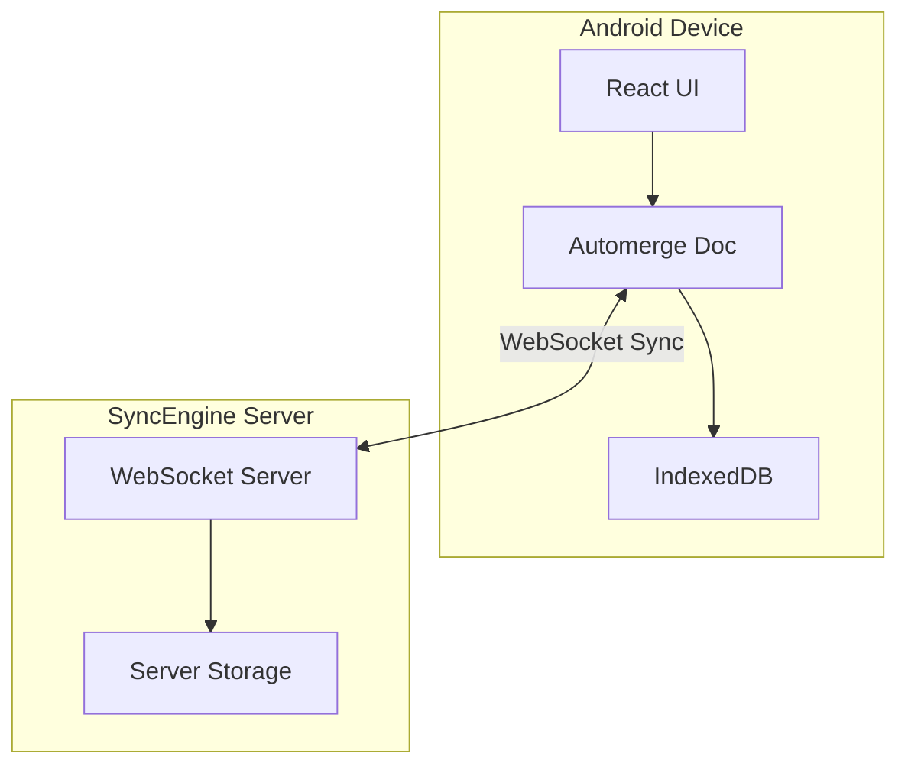

# System Diagram

```mermaid
graph TD
    subgraph "Android Device"
        UI[React UI]
        AM[Automerge Doc]
        IDB[IndexedDB]
        UI --> AM
        AM --> IDB
    end

    subgraph "SyncEngine Server"
        WS[WebSocket Server]
        Storage[Server Storage]
        WS --> Storage
    end

    AM <-->|WebSocket Sync| WS
```
