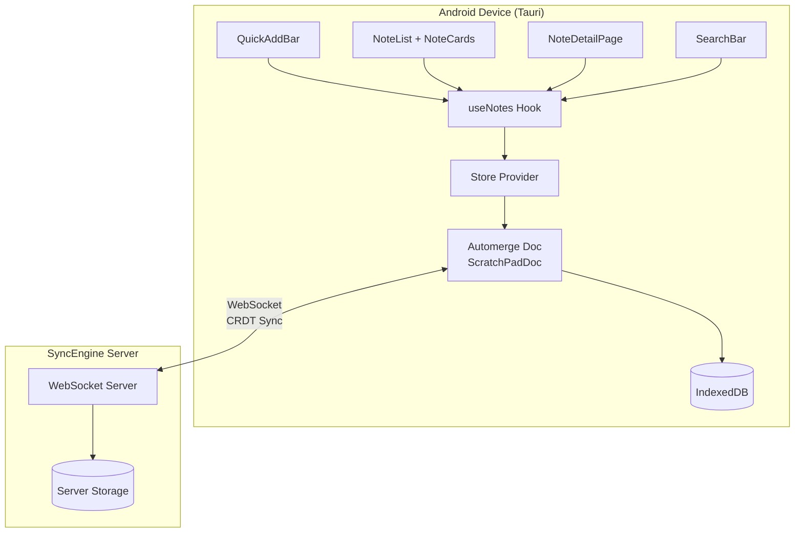

# System Diagram

```mermaid
graph TD
    subgraph "Android Device (Tauri)"
        QAB[QuickAddBar]
        NL[NoteList + NoteCards]
        NDP[NoteDetailPage]
        SB[SearchBar]
        Hook[useNotes Hook]
        SP[Store Provider]
        AM[Automerge Doc<br/>ScratchPadDoc]
        IDB[(IndexedDB)]

        QAB --> Hook
        NL --> Hook
        NDP --> Hook
        SB --> Hook
        Hook --> SP
        SP --> AM
        AM --> IDB
    end

    subgraph "SyncEngine Server"
        WS[WebSocket Server]
        Storage[(Server Storage)]
        WS --> Storage
    end

    AM <-->|"WebSocket<br/>CRDT Sync"| WS
```
