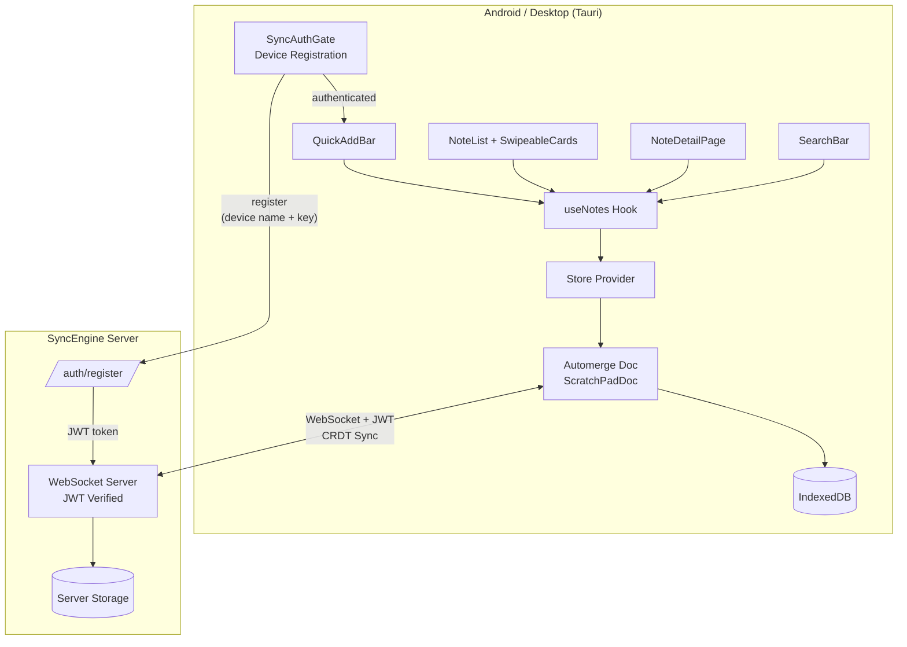

# System Diagram

```mermaid
graph TD
    subgraph "Android / Desktop (Tauri)"
        AUTH[SyncAuthGate<br/>Device Registration]
        QAB[QuickAddBar]
        NL[NoteList + SwipeableCards]
        NDP[NoteDetailPage]
        SB[SearchBar]
        Hook[useNotes Hook]
        SP[Store Provider]
        AM[Automerge Doc<br/>ScratchPadDoc]
        IDB[(IndexedDB)]

        AUTH -->|authenticated| QAB
        QAB --> Hook
        NL --> Hook
        NDP --> Hook
        SB --> Hook
        Hook --> SP
        SP --> AM
        AM --> IDB
    end

    subgraph "SyncEngine Server"
        REG[/auth/register/]
        WS[WebSocket Server<br/>JWT Verified]
        Storage[(Server Storage)]
        REG -->|JWT token| WS
        WS --> Storage
    end

    AUTH -->|"register<br/>(device name + key)"| REG
    AM <-->|"WebSocket + JWT<br/>CRDT Sync"| WS
```
